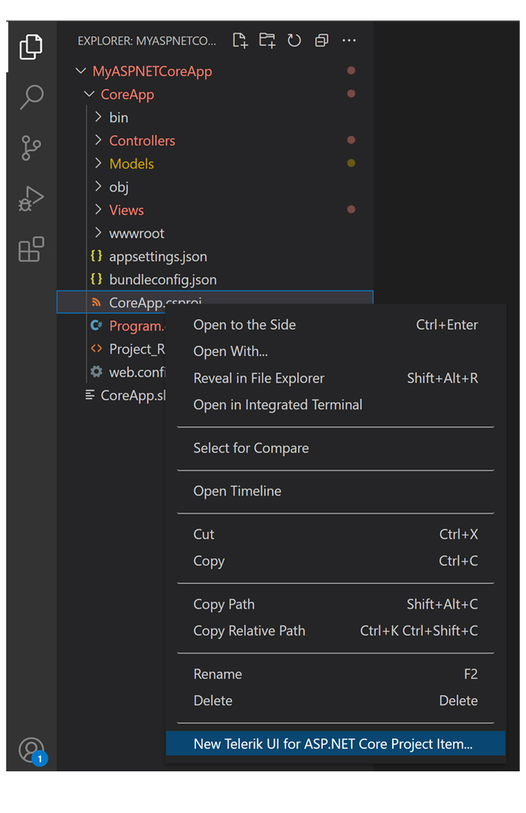
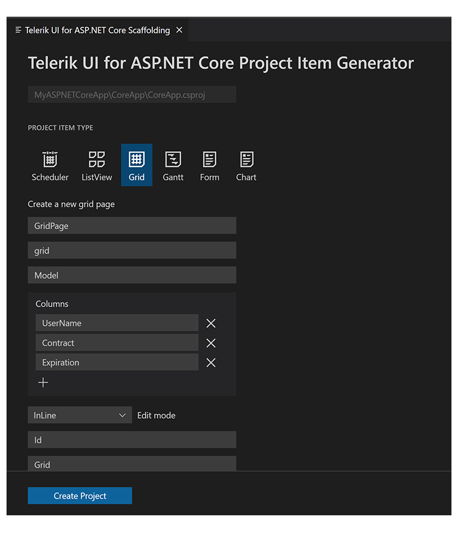

# Visual Studio Code Scaffolder

The {{site.product}} Visual Studio Code Scaffolder allows you to quickly generate Views with some of the most popular components.

The Visual Studio Code Scaffolder is part of the  {{site.product}} Productivity Tools. It aims to simplify the process of adding {{site.product_short}} components to an application. Adding a new View you can choose from a set of components, including the Grid, Chart, and Form, and customize their options.

## Available Components

Using the {{site.product}} Visual Studio Code Scaffolder you can quickly generate a Views with the following components:

* [Grid]()
* [Chart]()
* [Form]()
* [ListView]()
* [Gantt]()
* [Scheduler]()

## Adding a Scaffolded View

1. To use the Scaffolder right click on the `.csproj` file and select **New Telerik UI for ASP.NET Core Project Item**

    

1. The **Telerik UI for ASP.NET Core Project Item Generator** will prompt you to select Project Item Type. It will allow you to configure multiple component-specific properties and provide the customizable options for the scaffolded page.

    

1. Confirming the options will generate a View containig the selected component, with the provided configuration options.

For example, if you scaffold a new page with the {{site.product}} Grid component, you will be able to set the CRUD endpoints for the DataSource, set the configuration for sorting, filtering, grouping, column resizing and along with additional configuration settings.
